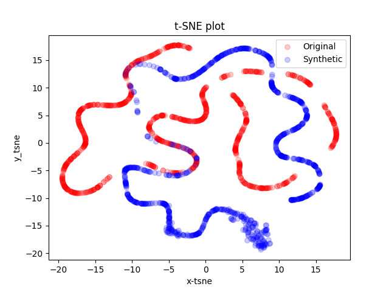

TimeGAN 作为经典的时间序列生成模型，因其能够合成具有时间序列统计特性和局部静态特性的高质量数据而受到广泛关注。然而，该模型的性能受到以下两个问题的限制：未能有效融合频域信息，以及在训练过程中生成器的训练程度大于判别器。
为了解决这些问题，本文提出了 TFGAN，该模型引入了时频一致性约束，并结合低频信号分析设计了一种新的判别器框架（TFC），以进一步提高原始模型的精度和泛化能力。

TFGAN 基于 TimeGAN 的外部框架，并有效捕捉原始数据的复杂时间动态特性。通过基于时频一致性约束的内部框架，进一步挖掘原始数据中隐藏的周期性和趋势特征，并在一定程度上平衡生成器和判别器的性能。定量和定性实验结果表明，在多个
真实基准数据集上，TFGAN 的表现优于 TimeGAN 及部分现有的先进方法。在基准数据集的定量指标（预测评分和判别评分）上，相较于原始模型，TFGAN 的性能提升了 10.88%；在股票数据集上的性能提升更是达到了 26.43%。

通常只依赖时间域和频域数据的模型会存在点异常和季节异常问题

  
  

所设计的全新判别器框架如下，基于时频一致性：

  

注意：新的判别器框架为了应对有着明显长周期或长期趋势的数据集，额外设计了低频处理模块

TFGAN模型在量化指标及可视化上都优于TimeGAN，可视化对比如下（左侧为TFGAN，右侧为TimeGAN，stock数据集,都基于timeGAN的最优超参数）：

  
  

  
  

且由于TFGAN一定程度上平衡了TimeGAN原模型GAN框架内生成器和判别器的性能，避免了模式奔溃，训练过程相对TimeGAN更加稳定（左侧为TFGAN，右侧为TimeGAN）

  
  

  
  

另外，通过额外设计的sine数据集(六维，周期240，每个维度频率随机)，验证了低频处理模块的有效性（seq_len参数设置为24，低频处理模块步长resampled_interval参数设置为10）

没有低频处理模块作用的结果：

  
  

有低频处理模块作用的结果：

  
  

原始模型TimeGAN论文地址：
https://papers.nips.cc/paper/2019/file/c9efe5f26cd17ba6216bbe2a7d26d490-Paper.pdf

